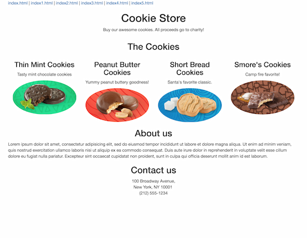
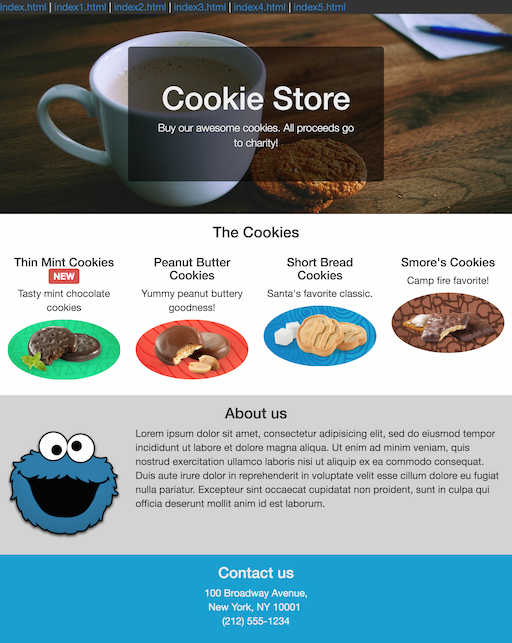
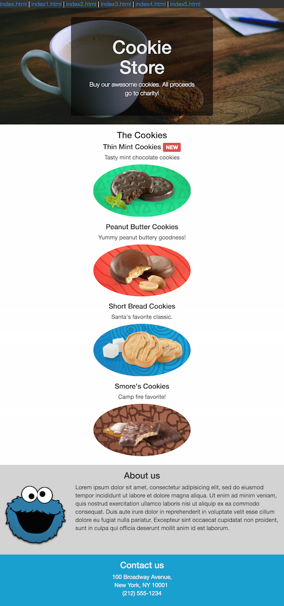
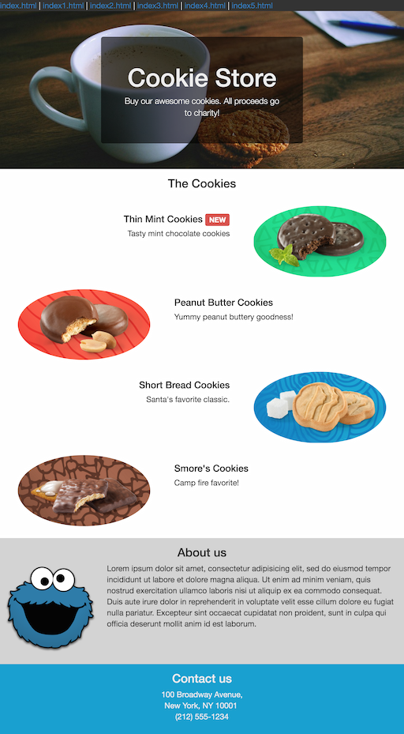

# Bootstrap lab

## Project 1: Build a responsive cookie store web page

In this exercise, you have been given an index.html file that already contains our content. What we will do in the next steps is add bootstrap for styling and for a responsive layout.

0. Fork this repository
1. Clone your own fork of the project
2. Link the `css/styles.css` file in the index.html `<head>` section.
    - _We will use this to add our own custom styles._
3. Add Bootstrap
    - Use the [CDN link tag](https://getbootstrap.com/docs/4.5/getting-started/introduction/#quick-start)
4. Apply the [bootstrap grid classes](https://getbootstrap.com/docs/4.5/layout/grid/)
    - The 4 cookie products should appear side by side in one row on large screens
    - The 4 cookies should appear one per row on medium and smaller screens
    - 
5. Apply styling to make the page responsive as follows:
    - On larger screens:
    - 
    - On medium and smaller screens:
    - 
6. Using only bootstrap styles, and not moving any html tags, make the cookie products alternate as follows on larger screens:
    - 
    - _Hint:_ You can wrap your existing HTML in extra `
` tags
    - _Hint:_ Look into the [reordering classes](https://getbootstrap.com/docs/4.5/layout/grid/#reordering)
    - *Clarifications*
        + _Don't_ change the order of the 3 main cookie html tags, the `<h3>`, followed by the `
`, and then the `` tags. _Remember, we want to keep semantic order._
        + You can add `
`'s and bootstrap classes as needed, you can wrap any tags in divs as needed, as long as you don't change the order.
7. **Stretch** Add a custom google font to our page:
    - Select and link a font from: https://fonts.google.com/
    - Add the font style to select tags
8. **To Submit**
    - Make a pull request back to this repo
    - Mention your Instructor and TA's name in your pull request

## Project 2: Build a Professional Portfolio Website for yourself

- Build a Professional Porfolio Website. Follow the following criteria
    * Use HTML5, CSS, Bootstrap (*optional*)
        - You can use existing themes (i.e. http://bootswatch.com/)
    * For the content:
        - Introduce yourself
        - Post projects you have done
        - Education/Professional Experience, Relevant Skills
        - List any technology or blog links you recommend
        - Include at least one image (project related, you, or related picture)
        - _Optional:_ Post a "blog" entry about a technology you have used, or school topic
